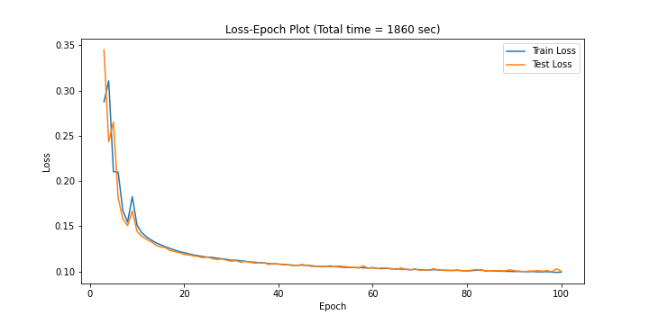

# Autoencoders in PyTorch

## Denosing Autoendoder
Autoencoder which can remove noise from MNIST images.

## Variational Autoencoder
Variational Autoencoder which can be used as a Generative model to generate MNIST images.

